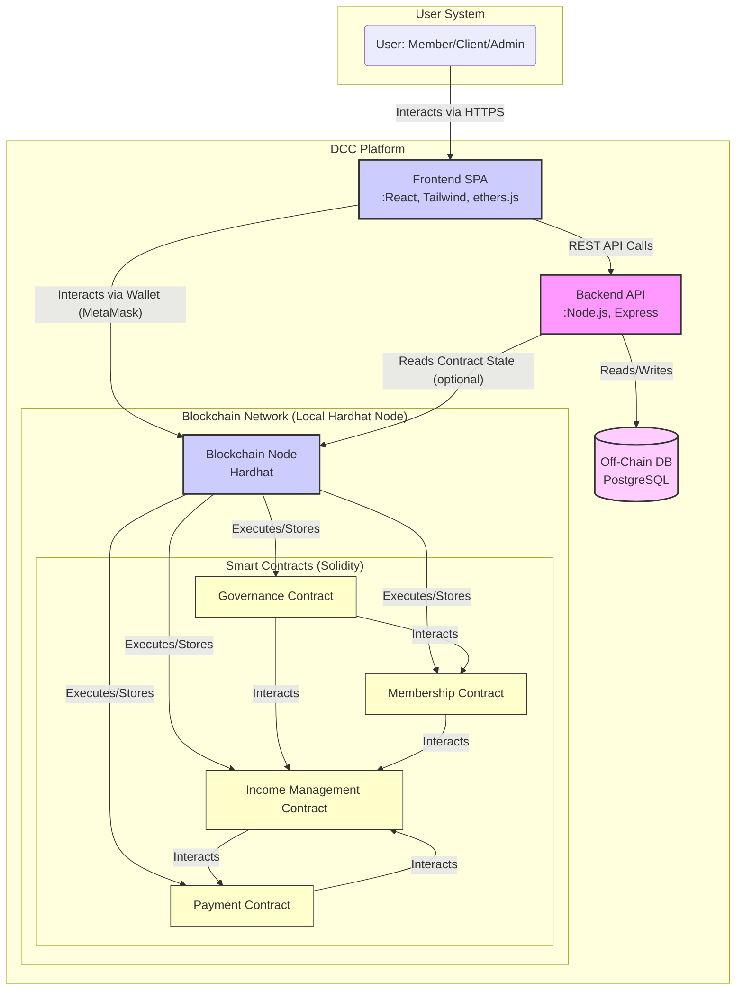
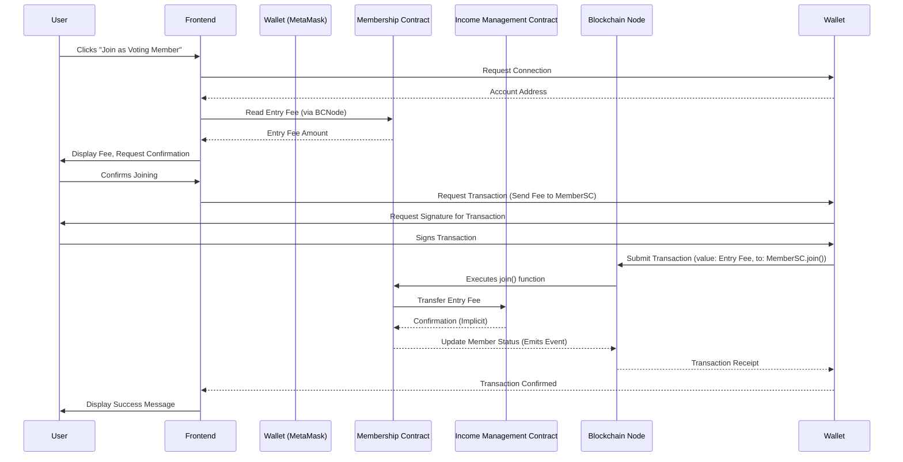
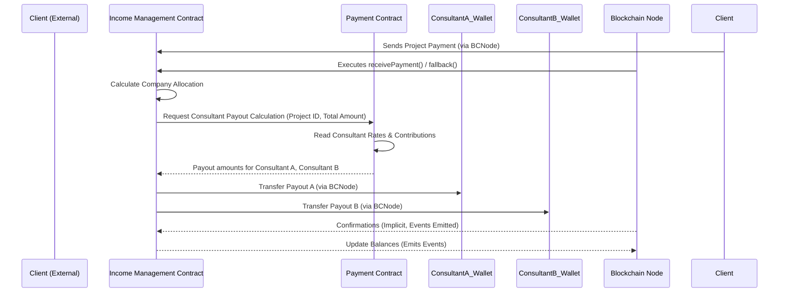

# DCC System Architecture Design

## 1. Overview

This document outlines the proposed system architecture for the Decentralised Consulting Collective (DCC), based on the whitepaper, user stories, and pseudocode specifications. The architecture aims to be scalable, secure, and modular, leveraging blockchain for core governance and financial operations while using traditional web technologies for user interaction and off-chain data management.

## 2. Goals

*   Implement core DCC functionality using smart contracts for transparency and automation.
*   Provide an intuitive web-based frontend for members and clients.
*   Ensure secure and reliable operation.
*   Enable decentralised governance as defined in the whitepaper.
*   Facilitate easy deployment and management using Docker.
*   Support Test-Driven Development (TDD).

## 3. Technology Choices

*   **Frontend:** React (with Vite for build tooling), Tailwind CSS
*   **Blockchain:** Local Hardhat Network (simulating Polygon/Ethereum) running on the user's laptop.
*   **Smart Contracts:** Solidity
*   **Blockchain Interaction:** ethers.js
*   **Backend API (for Off-chain data):** Node.js with Express.js
*   **Database (Off-chain):** PostgreSQL
*   **Containerization:** Docker, Docker Compose

**Rationale:**

*   **React:** Popular, large community, component-based, suitable for SPAs. Vite provides fast development experience.
*   **Tailwind CSS:** Utility-first CSS framework for rapid UI development.
*   **Hardhat:** Excellent development environment for Ethereum/Solidity, providing local network, testing tools, and deployment scripts. Easy to configure for the user's laptop node.
*   **Solidity:** Standard language for EVM-compatible blockchains.
*   **ethers.js:** Robust and widely used library for interacting with Ethereum-like blockchains.
*   **Node.js/Express:** JavaScript ecosystem consistency, suitable for building REST APIs for off-chain logic.
*   **PostgreSQL:** Reliable open-source relational database for structured off-chain data (e.g., detailed project info, user profiles beyond wallet address).
*   **Docker/Docker Compose:** Standard for containerization, simplifying setup, deployment, and environment consistency.

## 4. Architecture Diagram (C4 Model - Component Level)

## 5. Components

*   **Frontend SPA (Single Page Application):**
    *   Built with React and styled with Tailwind CSS.
    *   Handles user authentication (via wallet connection like MetaMask).
    *   Provides interfaces for viewing collective info, managing membership, submitting proposals, voting, viewing project details, and managing payments (depending on user role).
    *   Interacts directly with the Blockchain Node via ethers.js for contract calls and event listening.
    *   Interacts with the Backend API for off-chain data (e.g., user profiles, detailed project descriptions).
*   **Backend API:**
    *   Built with Node.js/Express.
    *   Provides RESTful endpoints for managing off-chain data stored in the PostgreSQL database.
    *   Handles user profile information beyond wallet address, detailed project descriptions, client communication logs (if needed).
    *   May potentially cache some on-chain data for faster frontend loading, but primary source of truth for core logic remains the blockchain.
    *   Handles authentication/authorization for API endpoints (e.g., using JWT or session management linked to wallet signatures).
*   **Off-Chain Database:**
    *   PostgreSQL database.
    *   Stores data not suitable or efficient for the blockchain (e.g., large text descriptions, user preferences, potentially project task breakdowns).
*   **Blockchain Node:**
    *   Local Hardhat network running on the user's machine.
    *   Executes smart contract transactions and stores the blockchain state.
    *   Provides RPC endpoint for the Frontend (and potentially Backend API) to interact with.
*   **Smart Contracts:**
    *   **Governance Contract:** Manages voting, proposals, membership rules, addresses of other contracts.
    *   **Membership Contract:** Manages member registration, types, fees, and potentially voting power delegation.
    *   **Income Management Contract:** Handles client payments, company allocation, triggers distributions.
    *   **Payment Contract:** Stores consultant rates, calculates earnings, facilitates payouts triggered by Income Management.

## 6. Key Interaction Flows (Sequence Diagrams)

### 6.1. New Voting Member Onboarding

### 6.2. Client Payment & Consultant Distribution

## 7. Off-Chain Data Management

*   **Purpose:** Store data that is inefficient, costly, or unnecessary to keep on the blockchain. Examples: detailed user profiles, project descriptions, task breakdowns, communication logs.
*   **Mechanism:** The Backend API provides endpoints for CRUD operations on this data stored in the PostgreSQL database.
*   **Linking:** Data can be linked to on-chain entities using wallet addresses or project IDs.
*   **Consistency:** Care must be taken to ensure consistency between on-chain state (e.g., project completion status) and off-chain details. Event listeners on the frontend/backend can trigger updates to off-chain data based on blockchain events.

## 8. Security Considerations

*   **Smart Contracts:**
    *   Use established security patterns (e.g., Checks-Effects-Interactions).
    *   Employ access control mechanisms (e.g., Ownable, Role-Based Access Control).
    *   Protect against reentrancy attacks.
    *   Thorough testing (unit, integration, potentially fuzzing).
    *   Consider external audits before mainnet deployment (even if starting local).
    *   Use secure libraries (e.g., OpenZeppelin).
*   **Frontend:**
    *   Protect against Cross-Site Scripting (XSS).
    *   Validate all user input.
    *   Secure interaction with wallet (use established libraries like ethers.js correctly).
    *   Handle transaction signing securely.
*   **Backend API:**
    *   Secure API endpoints (authentication, authorization).
    *   Input validation.
    *   Protect against common web vulnerabilities (SQL injection, etc.).
    *   Rate limiting.
*   **Infrastructure:**
    *   Secure configuration of the blockchain node.
    *   Secure database access.

## 9. Containerization & Deployment Strategy

*   **Docker:** Each main component (Frontend, Backend API, Database) will be containerized using Dockerfiles.
*   **Docker Compose:** A `docker-compose.yml` file will orchestrate the local development environment, linking containers and managing networks/volumes. This will include:
    *   Frontend service (React app)
    *   Backend API service (Node.js app)
    *   Database service (PostgreSQL)
    *   (Optional) Hardhat node service, although often run directly on the host during development for easier interaction/debugging. If containerized, ensure ports and volumes are correctly mapped.
*   **Deployment:**
    *   **Smart Contracts:** Use Hardhat scripts for deployment to the target network (initially the local Hardhat node). Contract addresses need to be managed and potentially stored in configuration files or within the Governance contract.
    *   **Frontend/Backend:** Build Docker images and deploy to a suitable hosting platform (e.g., cloud provider container service, VPS). Configuration management (API endpoints, contract addresses) is crucial.
    *   **Blockchain Node:** For production, this would be a connection to a public node provider (e.g., Infura, Alchemy) or a self-hosted node, not the local Hardhat instance. The user's laptop setup is for development/local simulation.

## 10. Next Steps

*   Set up the project structure (folders for frontend, backend, contracts, design, specs, tests).
*   Initialize Hardhat project for smart contracts.
*   Initialize React project for frontend.
*   Initialize Node.js project for backend API.
*   Implement TDD setup for smart contracts and potentially backend/frontend.
*   Begin implementation based on user stories and pseudocode, starting with core smart contracts.